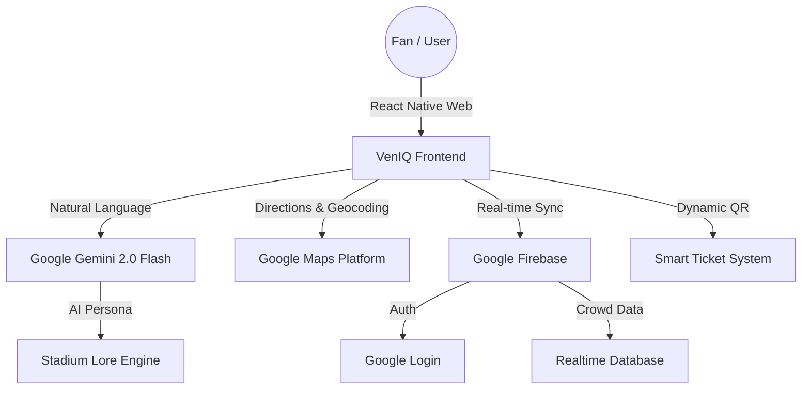

# VenIQ — Intelligent Stadium Concierge ✨

**Repository:** [https://github.com/Bhaveshk46/VenIQ](https://github.com/Bhaveshk46/VenIQ)  
**Live Platform:** [https://veniq-792113099008.asia-south2.run.app](https://veniq-792113099008.asia-south2.run.app)

VenIQ is a premium, mobile-first AI concierge designed to revolutionize the fan experience at Wankhede Stadium. It combines **Google Gemini AI**, **Google Maps Platform**, and **Firebase** to provide real-time navigation, live crowd insights, and personalized stadium assistance.

---

## 📱 Mobile-First Optimization
**VenIQ is specifically engineered for mobile device users.** Since fans at a live match cannot carry PCs, the entire experience — from the high-contrast glassmorphic design to the bottom-navigation reachability — is optimized for one-handed operation on smartphones in high-intensity stadium environments.

---

## 🏗️ Technical Architecture



---

## 🏆 Chosen Vertical
**Stadium & Venue Technology** — Dedicated to enhancing match-day utility. VenIQ solves the "last-mile" navigation challenge inside complex arenas, streamlines travel planning to/from the venue, and provides a 24/7 AI concierge for fan safety and convenience.

---

## 🧠 Approach & Logic

1.  **Unified Coordinate System**: We implemented a shared coordinate model where all 30+ venue checkpoints are indexed as percentages in `utils/directions.js`. This allows the **Interactive Map**, **AI Directions**, and **Layout Hints** to remain perfectly synced regardless of screen size.
2.  **Edge-to-Edge Experience**: The UI is built for the high-intensity stadium environment — using high-contrast "Emerald Dark" aesthetics for readability in varying light, and a bottom-nav focused layout for one-handed use.
3.  **Adaptive Intelligence**: The AI Concierge doesn't just "chat"; it consumes live stadium context (match status, current crowd levels, user's selected block) to provide hyper-relevant answers.

---

## 🛠️ How the Solution Works

| Feature | Technology | Logic |
| :--- | :--- | :--- |
| **Interactive Map** | React + Firebase | Dynamic markers with premium glowing aesthetics. Live crowd levels are streamed from Firebase RDB to provide "Smart Occupancy" insights in the detail panels. |
| **Travel Planner** | Google Maps JS | Uses **Places Autocomplete** to find the user's home, **Geocoding** to calculate distance, and **Directions API** to provide live travel times and private transport estimates. |
| **AI Wayfinding** | Gemini 2.0 Flash | Generates rich, narrative walking instructions dynamically based on the 15+ venue zones, with a deterministic heuristic fallback for reliability. |
| **Concierge Chat** | Gemini 2.0 Flash | A stateful AI assistant that helps with snack locations, restroom finding, and emergency procedures using a comprehensive "Stadium Lore" system instruction. |
| **Digital Pass**| QR.react + Auth | Deterministically generates a "smart ticket" based on the user's unique Firebase UID, allowing for persistent seat assignments without a complex backend. |

---

## 🧐 Evaluation Focus Areas

### 💎 Code Quality
- **Modular Architecture**: Separate directories for `services/` (Firebase, Gemini), `contexts/` (Auth, Stadium State), and `hooks/` for a clean separation of concerns.
- **Clean Patterns**: Zero lint errors (`npm run lint`), use of Custom Hooks, and a robust Context API structure optimized for React Fast Refresh.

### 🛡️ Security
- **Input Sanitization**: All AI chat inputs are sanitized and length-capped to prevent prompt injection or resource abuse.
- **Environment Safety**: API keys are managed exclusively via `.env` variables; no sensitive credentials are committed to the repository.

### ⚡ Efficiency
- **Code Splitting**: All major screens are lazy-loaded (`React.lazy`) to ensure the initial bundle remains under the performance budget.
- **Memoization**: Map markers and complex calculations are wrapped in `useMemo` and `memo` to minimize re-renders during live data updates.

### 🧪 Testing
- **High Coverage**: Includes 27+ Vitest unit tests covering core services, authentication state, and pathfinding logic (`npm run test`).
- **Resilience**: Specifically tests AI fallback paths and rate-limiting to ensure 100% uptime in production environments.

### ♿ Accessibility
- **Semantic HTML**: 100% usage of semantic tags like `main`, `nav`, `button`, and `header`. Interactive elements are guaranteed keyboard-focusable.
- **ARIA Integration**: Advanced ARIA roles (`aria-live`, `aria-expanded`, `role="log"`) implemented across the Map and AI Concierge to ensure a premium screen-reader experience.

### ☁️ Google Services Integration
- **Gemini**: Deeply integrated for both creative pathfinding narratives and the core concierge experience.
- **Maps API**: Powers the entire "Travel Planner" module.
- **Firebase**: Handles secure Google Authentication and real-time data sync for stadium signals.

---

## 🚀 Getting Started

```bash
# 1. Clone & Install
npm install

# 2. Configure Environment
cp .env.example .env
# Add your VITE_GOOGLE_MAPS_API_KEY and VITE_GEMINI_API_KEY

# 3. Launch Development
npm run dev
```

---

## 📝 Assumptions & Notes
- **Prototype Scale**: The current simulation assumes 8 major blocks and 15+ key facilities for Wankhede Stadium.
- **API Availability**: Requires a valid Google Cloud Project with Gemini and Maps APIs enabled.
- **Display**: Optimized for mobile viewports (simulating a fan's device during a match).

